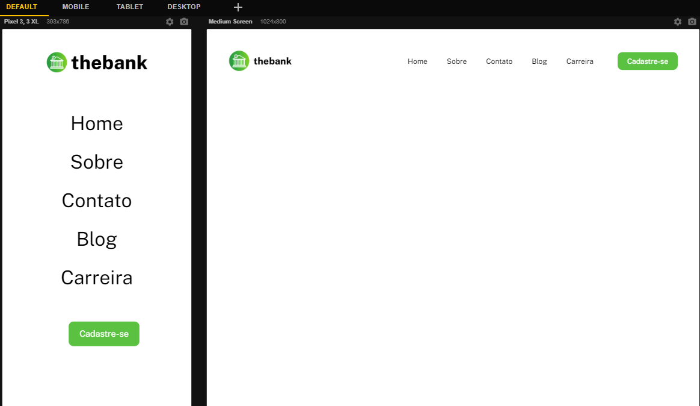

<h1 align="center">Menu - The Bank 💸</h1>

Desafio do curso DevQuest baseado em um menu de banco. O projeto foi elaborado sobre arquivo Figma. O projeto pode ser adaptado para outros seguimentos.

 
 <h2>🕹️ Tecnologias Utilizadas</h2>
    <ul align="center">
        
        
    </ul>

 

<h2 align="center">🤔 Como Utilizar</h2>
 
A página apresenta o logo, menu com links e uma opção de cadastro. Abaixo temos uma imagem da página:
 

<i>Funcionalidades do sistema</i>

<h2 align="center">📐 Página Responsiva ✂️</h2>

O projeto apresenta responsividade na navegação dos principais dispositivos: 

<ul>
    <li>Desktop 🖥️</li>
    <li>Tablet 💻</li>
    <li>Smartphone 📱</li>
</ul>

<h2 align="center">🔗 Link da página</h2>

Logo abaixo temos o link da página para visualização e testes:

👉 <a href="" target="_blank">Menu - The Bank</a>  

